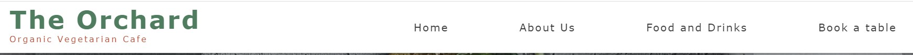

# The Orchard Cafe
This website was designed and developed to provide information on the fictional Orchard vegetarian cafe in Dublin's Phibsborough area to it's current and potential customers. It is targetted at customers of a wide age range who prefer to consume organic, fresh and locally produced vegetarian food and drinks in a comfortable environment.

The sections of the website provide information about the ethos of the cafe, the food and drink options that are on offer, a table booking section for customers and details of the location and opening times of the cafe. The imagery used in the website aims to entice customers to visit the cafe by showing delicious and fresh products and a warm friendly natural environment.

## Features

### Existing Features
- **Header and Navbar**
    - The header and navbar contains the logo(name of the cafe) plus its subtitle which announces its simple description ("Organic Vegetarian Cafe"). There are also four links to the Home, About Us, Food and Drinks and Table Booking sections providing quick access to the required information the user may be searching for. 

    - The navbar is minimalist in design in order to not overwhelm the user with too many options on first landing on the website. This follows the Hicks-Hyman Law of UX which examined the improved reaction times of users when confronted with less stimuli.

- **Hero Section**
    - The hero section section of the website aims to act as an enticement to explore the website further and in the end visit the cafe itself, by displaying an assortment of food and drinks products that would appeal to the customers of the cafe.
    - A user controlled slideshow is present allowing the user to control the image progression and study particular images if they so wish. I chose to use the format of a slideshow instead of a video or animation as some users may not wish to be distracted by a video or moving image when they arrive on the homepage. The slideshow and welcome message are all designed responsively to fir appropriately to the screen they are being viewed upon.
    - There is a call to action button present in the lower portion of the hero section that aims to encourage interaction with the website. A hover effect is integrated into the button to promote a pleasing response in the user also.

- **About Us Section**
    - This section contains three image card items with headings Fresh, Organic and Vegetarian, the three key features that the cafe would like to emphasise about the food options available. There is a hover (click on Mobile) interaction on each card with a pleasant slide transition that reveals further information about each topic when the user interacts with them. This promotes a positive response from the user encouraging further engagement.
    - The card layout is respnsively designed, flowing horizontally on larger screens and stacking one on top of the other on smaller displays.

- **Food and Drinks Menu Section**
    - This section consists of three menus - Breakfast, Brunch and Drinks. Rather than trying to squeeze all three on the page at the same time, I used a tab layout which allows the user to select the menu they are interested in, and avoids cluttering the section with too much information which might lead to cognitive overload on the part of the user.
    - The background is of a wood effect texture, which I chose to promote the theme of nature and organic produce on the website. The colour also added warmth to the page, as well as providing a virtual equivalent of sitting at the table in the cafe looking at the menu in person.

