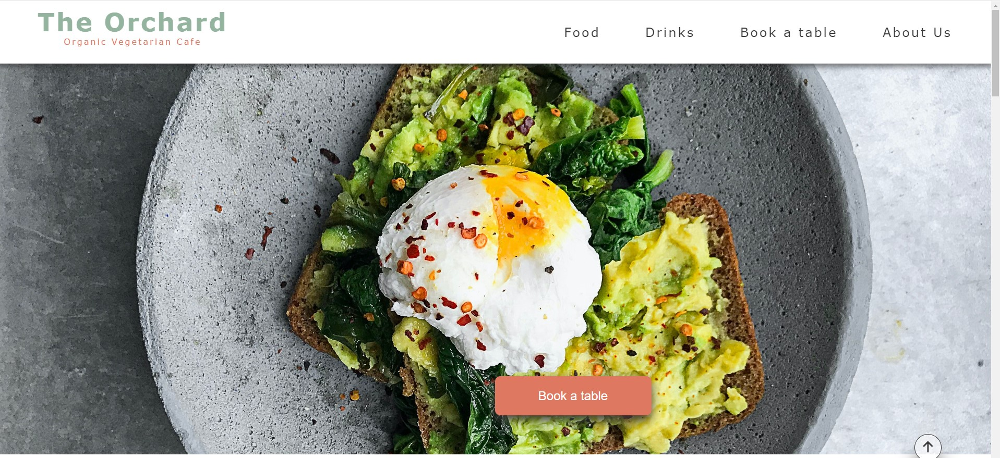

# The Orchard Cafe
This website was designed and developed to provide information on the fictional Orchard vegetarian cafe in Dublin's Phibsborough area to it's current and potential customers. It is targetted at customers of a wide age range who prefer to consume organic, fresh and locally produced vegetarian food and drinks in a comfortable environment.

The sections of the website provide information about the ethos of the cafe, the food and drink options that are on offer, a table booking section for customers and details of the location and opening times of the cafe. The imagery used in the website aims to entice customers to visit the cafe by showing delicious and fresh products and a warm friendly natural environment.

The live website on Github pages can be accessed at the following link: [View my Live Website on Github Pages here](https://christo107.github.io/CI-PP-01/)

## CONTENTS

* [Introduction](#the-orchard-cafe)

* [Sections and Pages](#sections-and-pages)
    *  [Header and Navbar](#header-and-navbar)
    *  [About Us](#about-us-section)
    *  [Food and Drinks](#food-and-drinks-menu-section)
    *  [Book a Table](#book-a-table-section)
    *  [Footer](#footer-section)
    *  [Booking Confirmation Page](#booking-confirmation-page)
* [User Experience](#user-experience)
    *  [User Stories](#user-stories)
* [Design](#design)
    *  [Colour Palette](#colour-palette)
    *  [Typography](#typography)
    *  [Imagery](#imagery)
    *  [Wireframes](#wireframes)
    *  [Accessibility](#accessibility)
* [Technologies Used](#technologies-used)   
    *  [Languages Used](#languages-used)
    *  [Frameworks, Libraries and Programs Used](#frameworks-libaries-and-programs-used)
* [Testing](#testing)
    * [Validator Testing](#validator-testing)
    * [Responsiveness Testing](#responsiveness-testing)
    * [Accessibility Testing](#accessibility-testing)
* [Bugs](#Bugs)
* [Deployment](#deployment)
* [Credits](#credits)
* [Acknowledgements](#acknowledgements)

## Sections and Pages

### Existing Sections
- #### **Header and Navbar**
    - The header and navbar contains the logo(name of the cafe) plus its subtitle which announces its simple description ("Organic Vegetarian Cafe"). There are also four links to the Home, About Us, Food and Drinks and Table Booking sections providing quick access to the required information the user may be searching for. 

    - The navbar is minimalist in design in order to not overwhelm the user with too many options on first landing on the website. This follows the Hicks-Hyman Law of UX which examined the improved reaction times of users when confronted with less stimuli.

- #### **Hero Section**
    - The hero section section of the website aims to act as an enticement to explore the website further and in the end visit the cafe itself, by displaying an assortment of food and drinks products that would appeal to the customers of the cafe.
    - A user controlled slideshow is present allowing the user to control the image progression and study particular images if they so wish. I chose to use the format of a slideshow instead of a video or animation as some users may not wish to be distracted by a video or moving image when they arrive on the homepage. The slideshow and welcome message are all designed responsively to fir appropriately to the screen they are being viewed upon.
    - There is a call to action button present in the lower portion of the hero section that aims to encourage interaction with the website. A hover effect is integrated into the button to promote a pleasing response in the user also.

- #### **About Us Section**
    - This section contains three image card items with headings Fresh, Organic and Vegetarian, the three key features that the cafe would like to emphasise about the food options available. There is a hover (click on Mobile) interaction on each card with a pleasant slide transition that reveals further information about each topic when the user interacts with them. This promotes a positive response from the user encouraging further engagement.
    - The card layout is respnsively designed, flowing horizontally on larger screens and stacking one on top of the other on smaller displays.

- #### **Food and Drinks Menu Section**
    - This section consists of three menus - Breakfast, Brunch and Drinks. Rather than trying to squeeze all three on the page at the same time, I used a tab layout which allows the user to select the menu they are interested in, and avoids cluttering the section with too much information which might lead to cognitive overload on the part of the user.
    - The background is of a wood effect texture, which I chose to promote the theme of nature and organic produce on the website. The colour also added warmth to the page, as well as providing a virtual equivalent of sitting at the table in the cafe looking at the menu in person.

- #### **Book a Table Section**
    - This feature allows the user to book a table at the cafe. This section can be accessed through manually scrolling to the section, clicking the link in the sticky navbar, or by clicking the 'call to action' button in the hero section.
    - The background image of the table with people around it enjoying food, books and drinks aims to communicate the positive social experience of being in the cafe with friends to encourage the customer to book a table and visit.
    - The colours used in the form section are from the palette used throughout the site, for example in the Logo, subtitle, CTA button and footer section.
    - A submitted form directs the user to a booking confirmation page with a thank you message. This extra page is added for demonstration purposes using the GET method, as the form is currently a dummy form with no information being sent out.

- #### **Footer section**
    - This section displays some important information regarding the location of the cafe. A large embedded google map link is included along with the address, telephone and email address of the cafe.
    - A list of the cafe's opening hours is included so customers are aware of when they can visit during the week
    - Links to the cafe's social media accounts are also present to encourage engagement on social media networks, and these all open in a new tab to allow the user to keep the main website open while they might be browsing the other links.

- #### **Booking confirmation page**
    - This additional page is reached by submitting a booking request on the book a table form on the homepage. It contains the same navigation and footer as the homepage, a thank you message along with a call to action button to view the food and drinks menus.
    - This page is for demonstration purposes only, and no form details are currently sent to a working email or database.

## User Experience

### User Stories

#### Client Goals
- A responsive website that is able to be viewed on multiple devices including laptps, tablets and mobile
- To inform potential or regular customers of the food and drinks options available in the cafe
- To allow the customer to book a table at the cafe at a time of their choosing
- To communicate the ethics of the cafe in its use of fresh, locally supplied, organic and vegetarian ingredients
- A website that entices the user to interact and to whet their appetites to increase footfall at the cafe

#### First Time Visitor Goals
- I want to find out what food options are available at the cafe
- I want to be able to book a table at the cafe 
- I want to see if the cafe is a nice place to eat
- I want to find out the location and opening hours of the cafe
- I want to visit the cafe's social media platforms to view their photos
- I want to find out the ethos of the cafe and whether it aligns with my own

#### Returning Visitor Goals
- I want to book a table for my next visit
- I want to see if the menu options have changed since my last visit
- I want to visit the cafe's social media platforms to view their photos
- I want to find out the location and opening hours of the cafe

## Design

### Colour Palette
- The colour palette was chosen to communicate the ethos of the cafe using organic, natural earthy tones that weren't distracting to the visitor, but added to the pleasing nature of the website.

### Typography
- The Verdana font was used throughout the website, being an accessible sans-serif font face, making the website easy to read for all visitors.

### Imagery
- All imagery for the website was downloaded from Pexels.com which provide free to use images. Credits for the images are listed in the credit section below and in the names of the images used.

### Wireframes
- I designed the website firstly through hand drawn sketches that were then turned into basic wireframes on Figma, before being made into high fidelity wireframes.

### Accessibility
- The website was designed and developed with accessibility in mind using colours that conform to the minimum 4.5:1 colour contrast ratio as per the WCAG 2.0 level AA Guidelines
- Semantic HTML elements allows for easier navigation of the website
- Alt text has been added to all non-decorative images used on the website
- Font style used is simple and easy to read for all users.

## Technologies used

### Languages used
- HTML5
- CSS3

### Frameworks, Libaries and Programs used
- [GitHub](https://github.com)
- [Gitpod](https://gitpod.io/workspaces)
- [Figma](https://www.figma.com/)
- [Optimizilla Image Compressor](https://imagecompressor.com)
- [Fontawesome](https://fontawesome.com/)
- [Am I Responsive](http://ami.responsivedesign.is/)
- [Coolers.co](https://coolors.co)
- [Pexels.com](https://pexels.com)
- [Chrome Dev Tools](https://www.google.com/intl/en_ie/chrome/)
- [A11y color contrast validator](https://color.a11y.com/Contrast/)

## Testing
The website was tested for markup and CSS validation, responsive design and accessibility using multiple browsers including Chrome, EDGE, and Firefox.
The W3C Markup validator retuned several erros on the 3rd September when tested. This included an error for a disallowed element present within a unordered list, an incorrect value for the width of an iframe, and a bad value for an input type on the booking form. These were all rectifiedin order to pass validation, as shown below. On CSS validation on the 8th September, an incorrect value was present in the grid rows style of the About us Card grid element. This was rectified to achieve oa pass on the validation. Please see screenshots of the previous results below:
[W3C Markup Result 03092022](./assets/images/Readme-images/W3C-Markup-Results-03092022.jpg) [W3C CSS Validator Result 08092022](./assets/images/Readme-images/W3C-CSS%20Validation-Report-08092022.jpg)

### Validator Testing
- HTML
    - Before final deployment, no errors were returned when passing through the offical [W3C validator](https://validator.w3.org/nu/?doc=https%3A%2F%2Fchristo107.github.io%2FCI-PP-01%2F)
- CSS
    - Before final deployment, no errors were found when passing through the official [(Jigsaw) validator](https://jigsaw.w3.org/css-validator/validator?uri=https%3A%2F%2Fchristo107.github.io%2FCI-PP-01%2F&profile=css3svg&usermedium=all&warning=1&vextwarning=&lang=en)

### Responsiveness Testing
- The website was tested for responsiveness using the Chrome and Firefox browsers and their associated Developer Tools. 
#### Chrome
- A variety of screen sizes were checked for responsiveness using the Developer tools from 4K displays at 2560px wide, laptop sizes 1440px and 1024px, tablets at 768px, and a variety of mobile sizes down to 320px width. All elements maintained functionality and visibility in all scenarios. Real world testing was also conducted on physical devices of various sizes to ensure integrity. No issue was encountered on these.
- A Lighthouse report was run several times to gauge the performance, accessibility, best practice and SEO scores. Early tests showed a performance score of less than optimal at 77, and accessibility at 93. By optimizing some of the imagery used on the site I was able to achieve a performace score of 93. There were a few missing alt tags on images and some colour contrast issues on the orgiginal test and once these were resolved, I was able to bring the accessibility score up to 100, with Best Practice and SEO also scoring 100.

[Lighthouse scoring Booking Confirmation page](./assets/images/Readme-images/Lighthouse-BookingPage-results-16092022.jpg)

### Accessibility Testing
- Multiple tests were run on the website using Lighthouse and A11y Color Contrast Accessibility Validator to examine any accessibility issues.
#### Firefox
- Firefox's built in colour blindness simulator was used to identify any areas where sufficient colour contrast was not present.

## Deployment
I used the Gitpod to develop th website and the site was deployed using GitHub Pages. Please see details below:

- The steps to deploy are as follows: 
  - In the GitHub repository, navigate to the Settings tab 
  - From the source section drop-down menu, select the Master Branch
  - Once the master branch has been selected, the page will be automatically refreshed with a detailed ribbon display to indicate the successful deployment. 

The live link can be found here - https://christo107.github.io/CI-PP-01/

## Bugs
### Fixed Bugs
- There was an issue with the Book a table call to action button that could not be centred in the hero section. This was fixed by changing the display of the containing wrapper to Flex and an align-items property of center.

- Header was overlapping section headers after scrolling to section. This was fixed with code taken from (https://css-tricks.com/fixed-headers-on-page-links-and-overlapping-content-oh-my/).

### Known Bugs
- Keyboard navigation via the tab key is restricted in some sections of the page including the food and drinks menu. I have tried to fix the bug using tabindex="0" attribute on elements but this has not resolved the issue.

## Credits

### Content 

- The text content of the website was written by the developer.
- The hero slider was modelled on the design by Avi Kohn with modifications to suit my needs.(https://codepen.io/AMKohn/details/DZYKEV)
- The icons in the small mobile nav menu and footer were taken from [Font Awesome](https://fontawesome.com/)
- The tab-style layout of the food and drinks menu was based upon a design by Wendy Ho, but modified and re-styled by me (https://codepen.io/Wendy-Ho/pen/MWWBvmd)
- The header section was inspired by the Love Running project by Code Institute.

### Media

- The imagery used in the hero slider, about us section, book a table section and food and drinks menu section were taken from the [Pexels.com](https://pexels.com) website, a source for free to use imagery. I would like to give credit to the creators of the images below-
    - [Viktoria Alipatova](https://www.pexels.com/@viktoria-alipatova-1083711/)
    - [Rodnae Productions](https://www.pexels.com/photo/assorted-pastries-on-a-white-surface-9242434/)
    - [Suzy Hazelwood](https://www.pexels.com/photo/sliced-strawberries-banana-and-blackberries-1120581/)
    - [Makus Spiske](https://www.pexels.com/photo/person-holding-brown-and-green-vegetable-1268101/)
    - [Pixabay](https://www.pexels.com/photo/close-up-of-strawberries-in-container-248420/)
    - [Adonyi Gabor](https://www.pexels.com/photo/three-yellow-corn-cobs-bell-pepper-cucumbers-and-chili-peppers-1414642/)
    - [Marta Dzedyshko](https://www.pexels.com/photo/person-using-espresso-machine-2775827/)
    - [Chevanon Photography](https://www.pexels.com/photo/close-up-of-coffee-cup-on-table-312418/)
    - [FWStudio](https://www.pexels.com/photo/brown-wood-surface-172289/)

## Acknowledgements
 - My mentor for his advice and assistance
 - The CI students who peer reviewed my website and gave feedback
